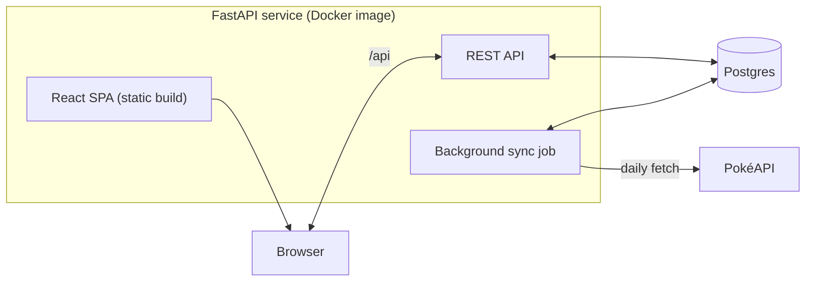
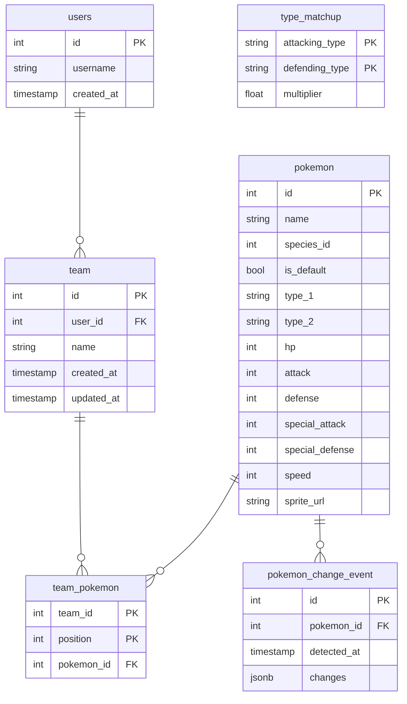

# Pokémon Team Builder

Web application for viewing Pokémon types and stats, building teams, and automatically generating counter teams using cached data from [PokéAPI](https://pokeapi.co/docs/v2).

You can find the production site [here](https://pokemon-team-builder-xdnl.onrender.com/).

## Overview

[FastAPI](https://fastapi.tiangolo.com/) web service serves a REST API and React single-page app, runs a background sync job, and connects to a Postgres database for storage. The front end uses [TanStack Query](https://tanstack.com/query/latest) to fetch and cache server data.



## Assumptions

- Teams have six members ordered by position.
- Pokémon have at most two types and the application only displays 6 base stats. Counter teams are generated using these.
- Damage multipliers come from PokéAPI. We only include 18 base types across the UI. Pokémon has more recently introduced special types like Stellar that don't cleanly fit into the type matchup chart.

## Data

A Postgres database stores relational data for users, teams, Pokémon data, and type matchups. The background sync job also writes Pokémon change events here, and the API reads them back.



Instead of executing SQL queries directly, the API and background sync job use SQLAlchemy as an object relational mapper. This makes logic easily testable as long as a database is running locally. [Alembic](https://alembic.sqlalchemy.org/en/latest/tutorial.html) migrations handle schema changes, so editing a model never requires running SQL by hand.

If the app required a more complex or flexible data model, a non-relational store might be suitable. For example, including Pokémon moves or other PokéAPI data available might make storing Pokémon as JSON documents simpler.

### Storage Assumptions

- `pokemon` includes one row per form. Alternate forms (i.e. "Mega" Pokémon) are stored separately (`species_id` is used to ensure alternate forms are ordered alongside their main form in application code).
- Type matchups are synced once a new database is set up and can't change without manually running `sync_type_matchup` in `backend/app/lib/sync.py`. Type matchup changes have only occurred a few times in Pokémon's history, so this is really a one-time setup.
- The database keeps a log of Pokémon change events rather than user-level alerts. It is the application's responsibility to read these and generate "change alerts" for a user based on their teams' Pokémon.

## Back End

FastAPI is used here to reduce boilerplate and keep Python readable by taking advantage of these features:
- Request validation, response serialization, and API docs are all handled just by defining Pydantic models.
- Support for dependency injection allows us to manage database sessions and resolve user id in each request's signature by including a generic dependency in the signature.
- Default support for async, which the background sync job uses to fetch PokéAPI data concurrently. While not a hard requirement, database access is also async, so the API and the job can share the same SQLAlchemy setup.

There is no real authentication implemented, so teams owned by any user are effectively public. The user id is stored in a signed cookie that the browser re-sends on each request, where a dependency injected into the FastAPI endpoint resolves it to a user. Adding real authentication (e.g. OAuth to avoid storing credentials) would require swapping out this dependency.

### Background Sync Job

A Cron-triggered background sync job synchronizes PokéAPI data (stats, types, new Pokémon). The [APScheduler](https://pypi.org/project/APScheduler/) library
ties the job to the FastAPI service's lifecycle, and an environment variable sets the schedule. A standalone serverless scheduled job would also work, but this simplifies deployment for a small project.

We make requests concurrently with `async` to speed up the job considerably (using a semaphore to bound concurrent requests). Stat and type changes get inserted into the database as a `pokemon_change_event`.

The job runs daily at 4AM ET, which is more than sufficient given that PokéAPI's data changes rarely. It can also be run manually for demo purposes with POST `/api/admin/sync` (with X-Admin-Secret header). No other API endpoints touch PokéAPI and only rely on persisted data.

If the data ingestion workflow ever became more complex (multiple data sources, more PokéAPI fields and entities, automated data quality checks or alerting, etc.), a separate orchestration solution like Airflow or Dagster would make sense.

## Front End

React single-page app built with Vite and styled with Tailwind. The front end code (e.g. React components, hooks for fetching server state) was largely AI-generated against the REST API contract and data flow specified here. TypeScript types are hand-written to match the back end's Pydantic models, which enforces the API contract at build time.

TanStack Query abstracts away caching of server state. `frontend/src/api/queries.ts` holds every read and write against the API. These are queries keyed by a name (e.g. `teams`, `pokemon`) that map one-to-one to an endpoint, and mutations for team writes and sign in/out.

There are no front end unit tests since most business logic exists on the server side.

## Tradeoffs and Improvements

- The API, SPA, and background sync job all run in the same Python process rather than deploying separately. This makes deployment straightforward and inexpensive, but makes horizontally scaling difficult. If two instances of the API run, there will be two background jobs running as well. Decoupling these and deploying static front end assets elsewhere would make scaling easier (i.e. two API processes behind a load balancer).
- There is no real-time push of Pokémon change events. The front end re-fetches whenever the user returns to the tab, which is sufficient given that data changes rarely. If more frequent updates ever became a requirement, options include polling by the browser, server-side events pushed to clients, or a database trigger that notifies the API on an insert/update.
- Alerts are "dismissed" by storing the `detected_at` timestamp of the newest alert seen in the browser's localStorage, and hiding everything older. In a future iteration, user alerts and dismissal status could be persisted somewhere.

## Deployment

[Render](https://render.com/) hosts both service and database with automatic GitHub deploys. A managed solution eliminates infrastructure overhead since this is a small project. The service is containerized which would make deployment elsewhere simple.

## Local Development Setup

This app can be run **(A)** fully in containers or **(B)** with FastAPI and Vite dev servers running on the host.

### Requirements
- Docker or equivalent

If running outside containers:
- [uv](https://docs.astral.sh/uv/)
- Node

### First-time setup

`./setup.sh` applies DB migrations, syncs the type matchups and Pokémon data from PokéAPI, then tears down containers.

These datasets rarely change and re-running is safe (will just request resources from PokéAPI again). Normally, the Pokémon portion runs on a schedule (see [Background Sync Job](#background-sync-job))

You can run the Pokémon sync against a running API as well:

```bash
curl -X POST -H "X-Admin-Secret: dev-admin-secret" localhost:8000/api/admin/sync
curl -X POST -H "X-Admin-Secret: dev-admin-secret" -H 'content-type: application/json' \
  -d '[25]' localhost:8000/api/admin/sync
```

### Startup

**A.** Everything in containers
```bash
docker compose --profile container up -d --build
docker compose --profile container down   # stop
```

or

**B.** API and front end on the host, DB in a container

```bash
docker compose up -d
cd backend && uv sync && uv run fastapi dev app/main.py
cd frontend && npm install && npm run dev
docker compose down
```

### Tests

```bash
cd backend && uv run pytest
```

Integration tests need the database container running and use their own `ptb_test` database. The rest are pure unit tests that don't require a database (e.g. `counter_team` tests).

### Database migrations

Alembic owns the schema and migrations are applied manually locally.

After editing `models.py`:

```bash
cd backend
uv run alembic revision --autogenerate -m "<Message>"
# Read and verify migration script!
uv run alembic upgrade head
```
